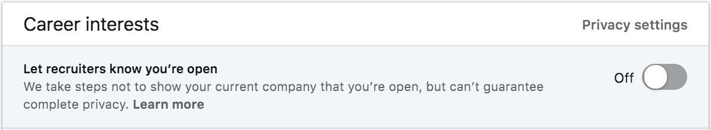

# Menjadi _Programmer_ Idaman

CekCok QODR | 20 Agustus 2018

by **Zain Fathoni**

Senior Software Engineer @ [Ninja Van](https://ninjavan.co)

---

## Kerangka Pembahasan

@ul

- Perkenalan
- Hak istimewa _programmer_
- Kriteria _programmer_ idaman
- Investasi karir seorang _programmer_
- Cara belajar _programmer_
- Tips meniti karir sebagai _programmer_

@ulend

---

## Perkenalan

+++

### Pendidikan

@ul

- Nama: Zain Fathoni
- Asal: Jember, Jawa Timur
- SD s.d. SMA di Jember
- Institut Teknologi Bandung
  - S1 Teknik Informatika
  - 2008 - 2014

@ulend

+++

### Pengalaman Kerja

<table>
  <tr>
    <th>Tahun</th>
    <th>Perusahaan</th>
    <th>Posisi</th>
  </tr>
  <tr>
    <td>2014</td>
    <td>QUN</td>
    <td>Programmer</td>
  </tr>
  <tr class="fragment">
    <td>2015</td>
    <td>Xtremax</td>
    <td>Software Developer</td>
  </tr>
  <tr class="fragment">
    <td>2015</td>
    <td>Xtremax</td>
    <td>Software Development Manager</td>
  </tr>
  <tr class="fragment">
    <td>2017</td>
    <td>Bukalapak</td>
    <td>Software Engineer</td>
  </tr>
  <tr class="fragment">
    <td>2018</td>
    <td>Ninja Van</td>
    <td>Senior Software Engineer</td>
  </tr>
</table>

Note:

- Lebih memilih jalur karir _technical_ daripada _managerial_
- Karena _programmer_ memiliki beberapa _privilege_ (hak istimewa)

---

## Hak Istimewa _Programmer_

+++

1. "Komoditas langka" yang sedang dicari

@ul

- Setiap pekan selalu ada yang menghubungi via LinkedIn
- Padahal sudah menyatakan diri bahwa tidak sedang berminat untuk pindah
- 

@ulend

+++

2. Kesempatan bekerja _remote_

@ul

- Bekerja dari rumah
  - Waktu bersama keluarga lebih banyak
- Biaya hidup lokal, gaji internasional

@ulend

+++

3. Kesempatan membuat _startup_ sendiri

@ul

- Ide itu murah, yang mahal adalah **eksekusi**
  - _Programmer_ memiliki kemampuan untuk **eksekusi**
- Banyak tawaran kerja sama menjadi CTO
  - Saya sendiri pernah mencobanya, walaupun pada akhirnya mundur
  - Lebih lanjut tentang ini dapat dibaca di tulisan saya yang berjudul [Banyak Anak Banyak Rezeki, Benarkah?](https://medium.com/pejuang-kode/banyak-anak-banyak-rezeki-benarkah-4f772701dfa3)
- Bisa menjadi [_Indie Hackers_](https://www.indiehackers.com/) seperti [Pieter Levels](https://levels.io/)

@ulend

---

## Kriteria _Programmer_ Idaman

---

## Investasi Karir _Programmer_

---

## Cara Belajar _Programmer_

---

## Tips Meniti Karir

---

### Alternatif jalur karir

1. Setia pada satu perusahaan
2. Kutu loncat
3. Tidak sering pindah, tidak pula terlalu setia

---

### Tips Pindah Perusahaan

- Mengapa pindah perusahaan?
- Kapan saatnya pindah perusahaan?
- Bagaimana caranya pindah perusahaan?

+++

#### Mengapa pindah perusahaan?

+++

### Kapan saatnya pindah perusahaan?

+++

### Bagaimana caranya pindah perusahaan?

---

### Pranala

- [Slide Presentasi](https://gitpitch.com/zainfathoni/cekcok/master)
- [LinkedIn](https://www.linkedin.com/in/zainfathoni/)
- [Telegram](https://t.me/zainfathoni)
